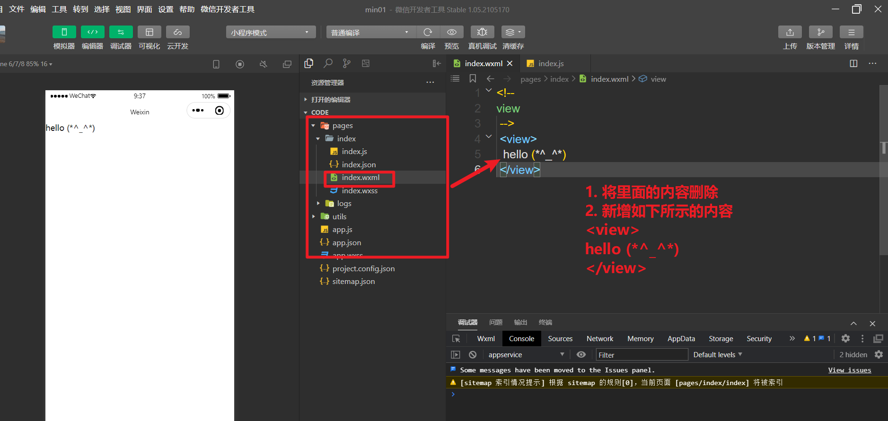


# 开发工具的介绍

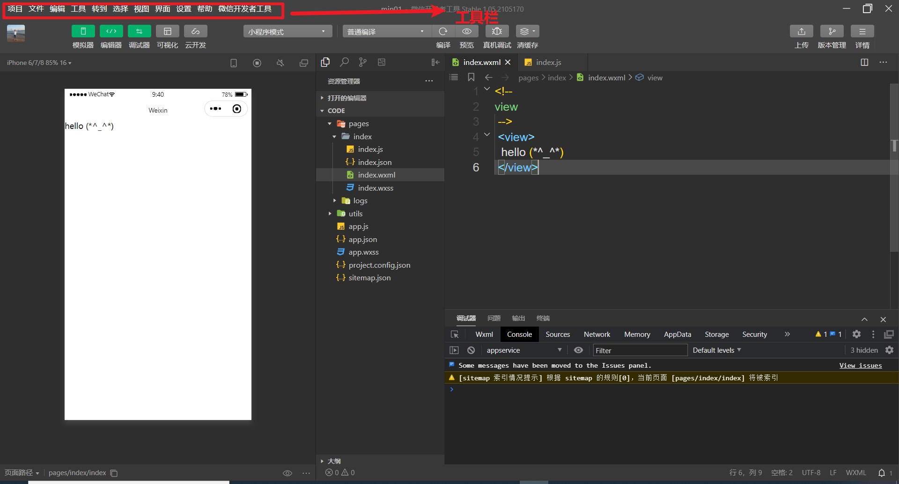

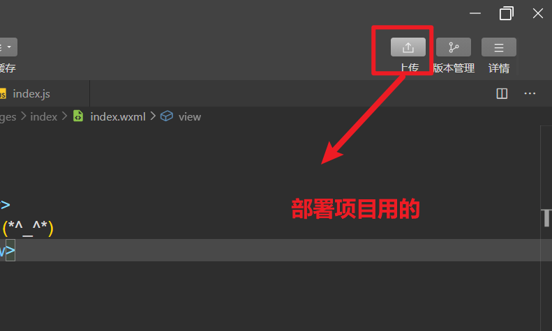

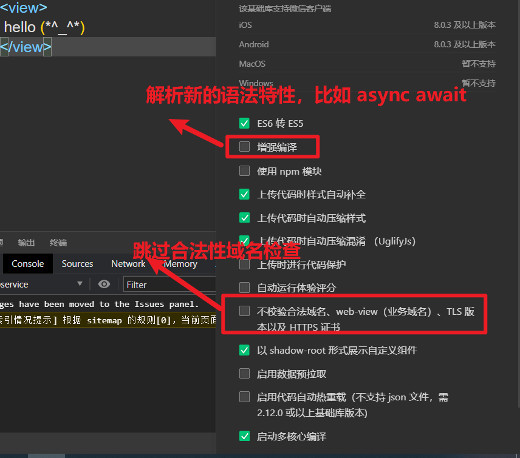


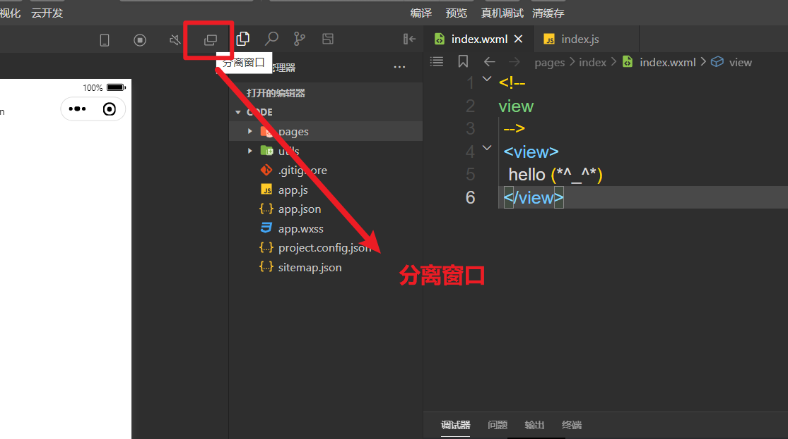


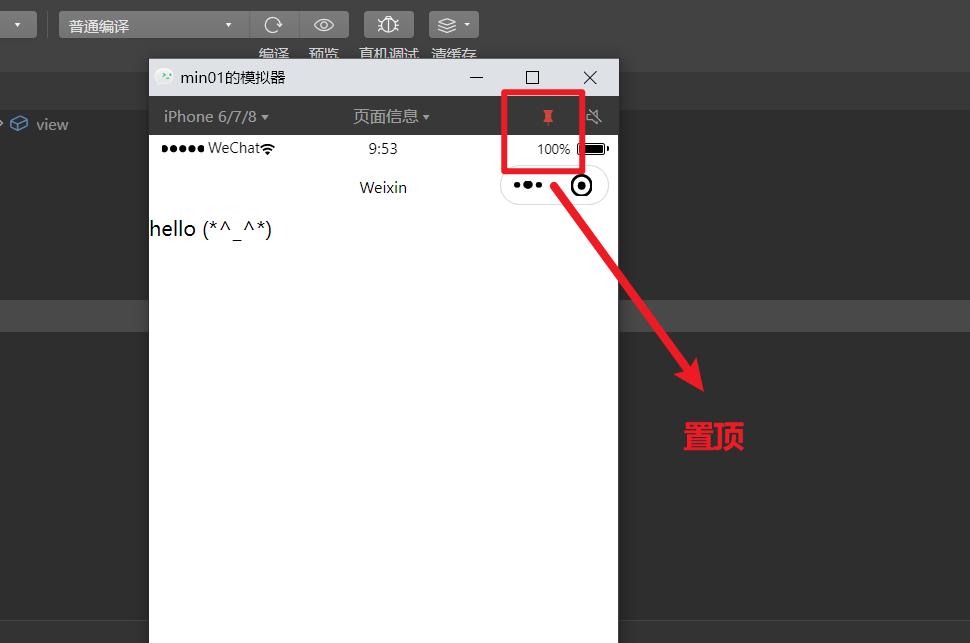


# 新增页面

第一种方式 

**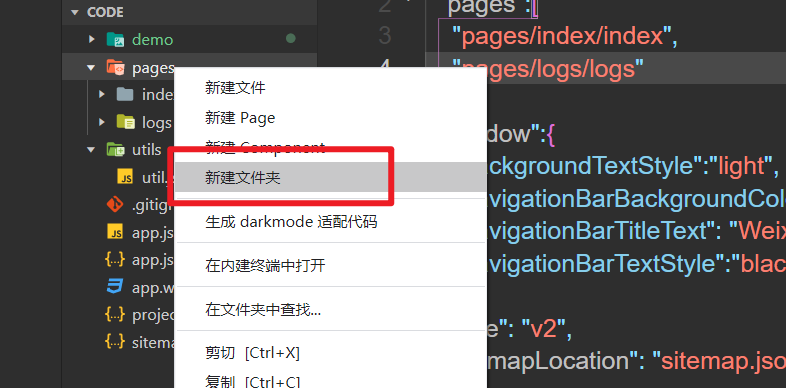**


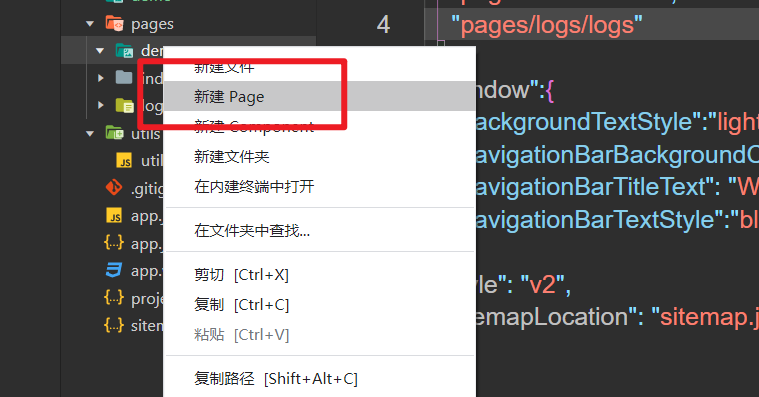

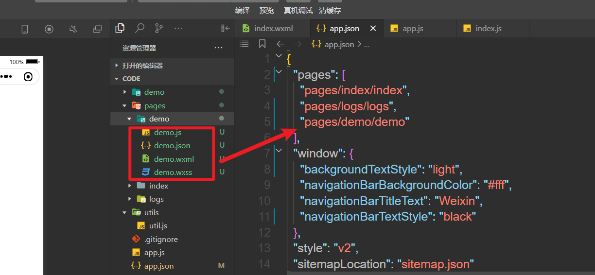

第二种方式

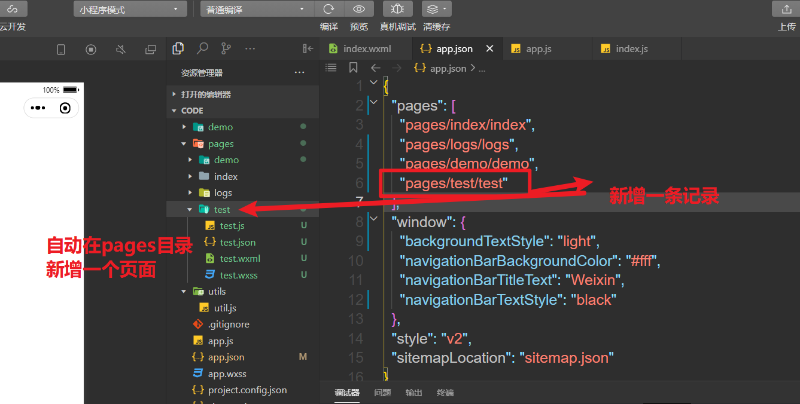


# pages 字段的特点

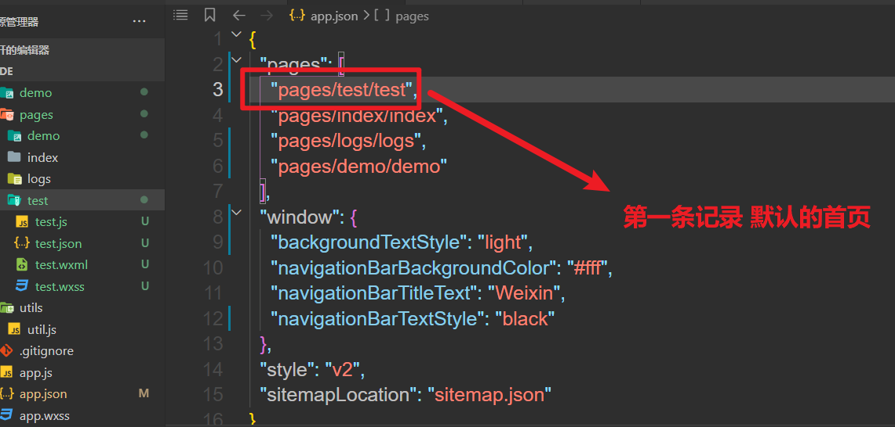


# pages 字段 练习：

新增demo 和test 页面，同时将test页面设置为启动页

# window 字段  练习

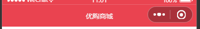

颜色：#ea4350

文字：优购商城

```bash
  "window": {
    "backgroundTextStyle": "light",
    "navigationBarBackgroundColor": "#ea4350",
    "navigationBarTitleText": "优购商城",
    "navigationBarTextStyle": "white"
  },
```

# tabbar字段 练习 实现优购商城的tabbar效果

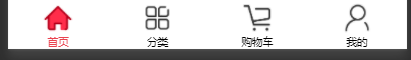


1. 拷贝图标

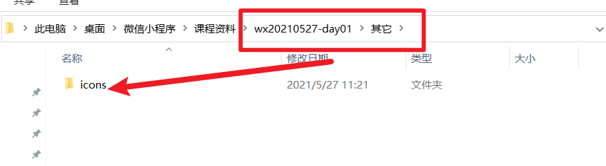

拷贝图标到项目根目录下面


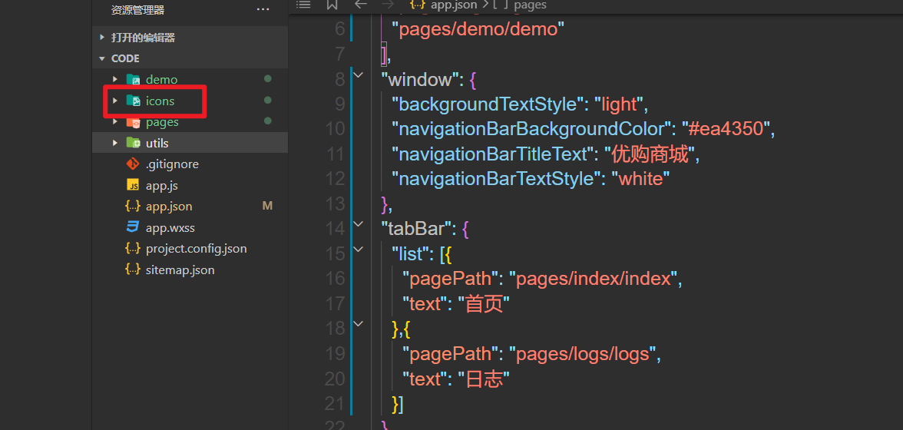

2 创建四个页面

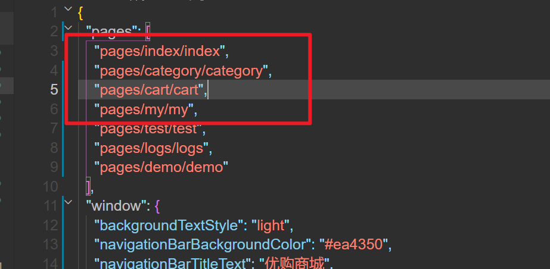

3. 写入以下配置

```json
  "tabBar": {
    "selectedColor": "#ea4350",
    "list": [{
      "pagePath": "pages/index/index",
      "text": "首页",
      "iconPath": "icons/home.png",
      "selectedIconPath": "icons/home-o.png"
    },{
      "pagePath": "pages/category/category",
      "text": "分类",
      "iconPath": "icons/category.png",
      "selectedIconPath": "icons/category-o.png"
    },{
      "pagePath": "pages/cart/cart",
      "text": "购物车",
      "iconPath": "icons/cart.png",
      "selectedIconPath": "icons/cart-o.png"
    },{
      "pagePath": "pages/my/my",
      "text": "我的",
      "iconPath": "icons/my.png",
      "selectedIconPath": "icons/my-o.png"
    }]
  },
```


# 补充

三个版本号

1.1.1

第一个版本号：通常大功能升级，可能存在api不兼容的情况

第二版本号：通常是新的特性

第三版本号：补丁或者修复一些 bug


企业需求

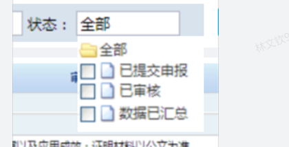